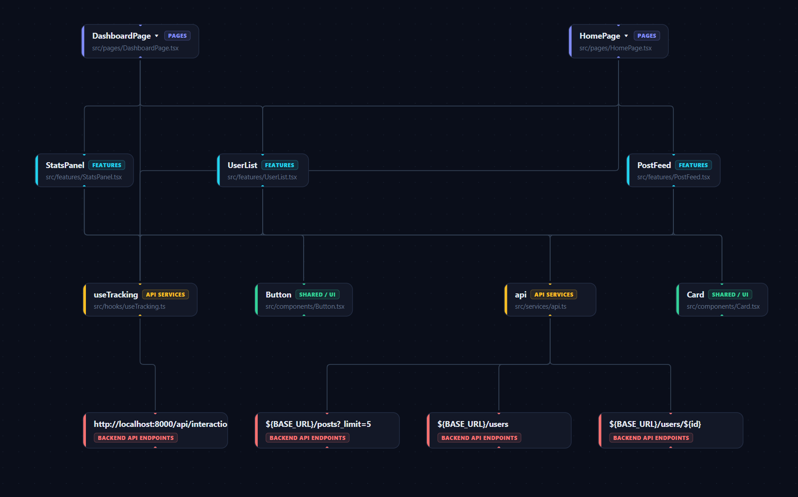
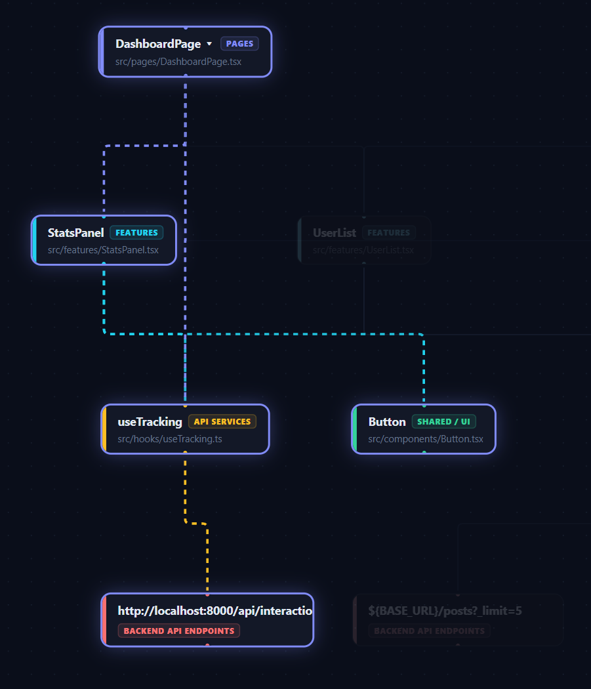

# Repo Visualizer

A hierarchical visualization system for React/TypeScript repositories with real-time runtime tracking.

## Architecture

```
┌─────────────┐    scans     ┌──────────────┐    serves     ┌───────────────────┐
│  Analyzer    │ ──────────► │  FastAPI      │ ◄──────────── │  Dashboard        │
│  (Python)    │             │  Backend      │   WebSocket   │  (React Flow)     │
└─────────────┘             │  :8000        │               │  :5173            │
                            └──────┬───────┘               └───────────────────┘
                                   │ WebSocket
                            ┌──────┴───────┐
                            │  Demo App     │
                            │  :3001        │
                            └──────────────┘
```




## Components

| Component     | Tech                | Port | Purpose                                            |
| ------------- | ------------------- | ---- | -------------------------------------------------- |
| **Analyzer**  | Python + regex      | —    | Scans React repos, builds `structure.json`         |
| **Backend**   | FastAPI + WebSocket | 8000 | Serves structure data, broadcasts runtime events   |
| **Dashboard** | React Flow + Dagre  | 5173 | Interactive hierarchical visualization             |
| **Demo App**  | React + Router      | 3001 | Sample app with 2 pages, 3 features, tracking hook |

## Layering Model

The analyzer classifies every file into a strict layer:

| Layer                 | Source                               | Color  |
| --------------------- | ------------------------------------ | ------ |
| **Pages**             | `src/pages/`, route definitions      | Purple |
| **Features**          | `src/features/`, `src/modules/`      | Cyan   |
| **Shared / UI**       | `src/components/`, `src/ui/`         | Green  |
| **API Services**      | `src/services/`, `src/api/`          | Amber  |
| **Backend Endpoints** | Extracted from `fetch`/`axios` calls | Red    |

## Quick Start

```bash
# One-command full-stack launch
chmod +x start.sh
./start.sh
```

### Manual Start

```bash
# 1. Backend
cd backend
python3 -m venv .venv && .venv/bin/pip install -r requirements.txt
.venv/bin/uvicorn main:app --reload --port 8000

# 2. Dashboard
cd dashboard
npm install && npm run dev

# 3. Demo App
cd demo-app
npm install && npm run dev
```

Then open the Dashboard at `http://localhost:5173`, enter the absolute path to the demo-app (or any React repo), and click **Sync**.

## Features

- **Hierarchical Dagre Layout** — nodes organized in strict layers, edges routed cleanly
- **Tree-shaking** — unused components (not imported from any page) are excluded
- **Collapse/Expand** — double-click a Page node to collapse/expand its features
- **Real-time Tracking** — the `useTracking` hook reports mount/unmount/click events via WebSocket
- **Active Node Highlighting** — nodes glow when their component is mounted in the demo app
- **Event Log** — live stream of runtime events in the dashboard sidebar
- **Sync Button** — re-scan the repo without reloading the dashboard

## Tracking Hook

Add real-time tracking to any React component:

```tsx
import { useTracking } from "./hooks/useTracking";

function MyComponent() {
  const { trackClick, trackApiCall } = useTracking("MyComponent", {
    filePath: "src/features/MyComponent.tsx",
  });

  return <button onClick={() => trackClick("save")}>Save</button>;
}
```

## Structure JSON Schema

```json
{
  "repoPath": "/abs/path",
  "layers": [
    { "id": "page", "index": 0, "label": "Pages", "color": "#4F46E5" }
  ],
  "nodes": [
    { "id": "...", "label": "HomePage", "layer": "page", "layerIndex": 0 }
  ],
  "edges": [{ "id": "...", "source": "...", "target": "..." }],
  "groups": [{ "parentId": "page_id", "childIds": ["feature_id"] }],
  "metadata": { "totalFiles": 12, "analyzedFiles": 10, "treeShakedFiles": 2 }
}
```
